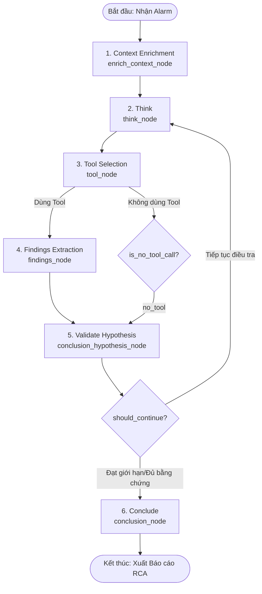

# Tài liệu Kiến trúc & Luồng hoạt động của AI-Agent-RCA

Tài liệu này giải thích chi tiết cơ chế hoạt động, luồng xử lý (flow) của hệ thống phân tích nguyên nhân gốc rễ tự động **AI-Agent-RCA**, đánh giá tính tương thích của các công cụ/thư viện AI hiện tại và các lỗi phát hiện được trong quá trình vận hành thực tế.

---

## 1. Kiến trúc & Sơ đồ Luồng hoạt động (Graph Flow)

`AI-Agent-RCA` được xây dựng dựa trên framework **LangGraph** dưới dạng một máy trạng thái (state machine) tuần hoàn, áp dụng phương pháp nghiên cứu khoa học: **Lập giả thuyết -> Tìm kiếm bằng chứng -> Xác thực giả thuyết -> Kết luận**.

Dưới đây là sơ đồ luồng hoạt động chi tiết của đồ thị trạng thái (state graph):



### Chi tiết các Node xử lý chính:

| Thứ tự | Tên Node | Vai trò & Hoạt động |
| :--- | :--- | :--- |
| **1** | **Context Enrichment** (`context`) | Nhận dữ liệu Alarm ban đầu (SNS/CloudWatch) và truy vấn kiến trúc hệ thống (Topology) từ CMDB. Đưa ra các nhận định sơ bộ ban đầu (`initial_findings`). |
| **2** | **Think** (`think`) | Dựa trên lịch sử điều tra trước đó, AI đưa ra một **Giả thuyết có khả năng xảy ra cao nhất** (RCA Hypothesis). Mỗi giả thuyết gồm: danh mục lỗi, dịch vụ bị ảnh hưởng, mô tả và độ tin cậy. |
| **3** | **Tool Selection** (`tool`) | AI quyết định chọn một công cụ phù hợp để xác thực giả thuyết hiện tại. Nếu bằng chứng đã đủ hoặc không có công cụ phù hợp, Agent sẽ chọn `NO_TOOL`. |
| **4** | **Findings Extraction** (`findings`) | Phân tích kết quả trả về từ công cụ, trích xuất và phân loại các bằng chứng thu được thành: `SYMPTOM` (Triệu chứng), `INTERMEDIATE` (Cơ chế trung gian), hoặc `ROOT_CAUSE` (Nguyên nhân gốc rễ). |
| **5** | **Validate Hypothesis** (`validate`) | Đối chiếu các bằng chứng tìm được với giả thuyết để cho điểm và đánh giá độ tin cậy. Áp dụng hệ thống Điểm thưởng (Bonus) / Điểm phạt (Penalty) để đưa ra trạng thái giả thuyết: `VALIDATE` (Đúng), `INVALIDATE` (Sai), hoặc `INCONCLUSIVE` (Chưa rõ). |
| **6** | **Conclude** (`conclusion`) | Tổng hợp toàn bộ lịch sử các vòng lặp điều tra và các phát hiện ban đầu để viết một báo cáo RCA hoàn chỉnh (Bao gồm: Incident Story, Threat Assessment, Attack Narrative, Affected Components, Root Cause, các lệnh AWS CLI xử lý nhanh và kế hoạch khắc phục). |

---

## 2. Kiểm tra & Đánh giá Tính tương thích của các AI Tools

Qua phân tích môi trường thực tế của hệ thống (`pip list`) và chạy thử nghiệm chạy đồ thị trạng thái, chúng tôi đã xác định được các điểm tương thích như sau:

### A. Phiên bản Thư viện (Package Compatibility)
*   **Tình trạng hiện tại:** Các thư viện chính như `langgraph` (v1.2.4), `langchain-core` (v1.4.1), và `langchain-aws` (v1.5.0) đang được cài đặt ở các phiên bản **v1.x (mới nhất)**.
*   **Đánh giá:** Các thư viện này hoàn toàn tương thích tốt với nhau và hỗ trợ các tính năng hiện đại nhất. Tuy nhiên, file cấu hình `requirements.txt` đang giới hạn các phiên bản tối thiểu rất cũ (`langgraph>=0.0.30`, `langchain-core>=0.1.30`). Việc này có thể dẫn đến việc cài đặt sai phiên bản trên môi trường mới nếu không có file lock.

### B. Lỗi Nghiêm trọng: Gọi Đồ thị Sync trong khi Node là Async
*   **Lỗi phát hiện:** 
    ```plain
    Execution failed: No synchronous function provided to "context".
    Either initialize with a synchronous function or invoke via the async API (ainvoke, astream, etc.)
    ```
*   **Nguyên nhân:** Toàn bộ các node trong thư mục `graph/nodes.py` đều được khai báo là hàm bất đồng bộ (`async def`). Tuy nhiên, trong mã nguồn `main.py` và `api.py`, đồ thị được gọi bằng hàm đồng bộ `.invoke()`. Với phiên bản LangGraph mới hiện tại, điều này bị cấm và gây lỗi runtime ngay lập tức.
*   **Giải pháp đã xử lý:**
    *   Đã cập nhật `main.py` để sử dụng `.ainvoke()`:
        ```python
        final_state = await INVESTIGATION_GRAPH.ainvoke(initial_state)
        ```
    *   Đã cập nhật `api.py` chuyển tác vụ chạy ngầm thành `async def` và gọi `await INVESTIGATION_GRAPH.ainvoke(state)`.

---

## 3. Lỗi Nghiêm trọng về Model ID trên AWS Bedrock

Khi chạy thử nghiệm đồ thị sau khi sửa lỗi bất đồng bộ, hệ thống gặp lỗi truy cập Model từ AWS Bedrock:

```plain
botocore.errorfactory.ResourceNotFoundException: An error occurred (ResourceNotFoundException) when calling the InvokeModel operation: Access denied. This Model is marked by provider as Legacy and you have not been actively using the model in the last 30 days. Please upgrade to an active model on Amazon Bedrock
```

### Nguyên nhân:
Trong `agent_models.py`, hệ thống đang sử dụng các Model ID cũ (Legacy):
*   **Claude 3.5 Sonnet:** `us.anthropic.claude-3-5-sonnet-20241022-v2:0`
*   **Claude 3.5 Haiku:** `us.anthropic.claude-3-5-haiku-20241022-v1:0`

Các model này đã bị nhà cung cấp AWS/Anthropic đánh dấu là **Legacy/Retired** (Hết vòng đời hoạt động) trong năm 2025/2026. Do tài khoản AWS của bạn không hoạt động thường xuyên với các Model ID này trong 30 ngày qua, AWS Bedrock đã khóa quyền truy cập của chúng.

### Khảo sát các Model Anthropic Claude khả dụng trên tài khoản của bạn:
Qua truy vấn trực tiếp vào dịch vụ Bedrock tại vùng `us-east-1`, các model Anthropic Claude thế hệ mới đang khả dụng bao gồm:
*   `anthropic.claude-sonnet-4-6` (Claude 4.6 Sonnet - Khuyên dùng cho tư duy phức tạp)
*   `anthropic.claude-sonnet-4-20250514-v1:0` (Claude 4 Sonnet)
*   `anthropic.claude-haiku-4-5-20251001-v1:0` (Claude 4.5 Haiku - Khuyên dùng cho tác vụ nhanh/Tool)
*   `anthropic.claude-3-5-haiku-20241022-v1:0` (Claude 3.5 Haiku bản gốc - Vẫn hoạt động nếu bỏ tiền tố `us.`)

---

## 4. Khuyến nghị Nâng cấp & Khắc phục nhanh

Để hệ thống hoạt động ổn định và tối ưu nhất, bạn cần thực hiện nâng cấp các Model ID trong file `agent_models.py`.

### Code đề xuất sửa đổi trong `AI-Agent-RCA/agent_models.py`:

```python
def get_model_by_phase(phase: str):
    """
    Trả về ChatBedrock được cấu hình cho từng phase tương ứng.
    Sử dụng Claude 4.6 Sonnet cho các phase tư duy phức tạp (think, conclusion, final)
    và Claude 4.5/3.5 Haiku cho các phase thực thi (context, tool, analyze).
    """
    region = os.getenv("AWS_DEFAULT_REGION", "us-east-1")
    
    # Lựa chọn model dựa trên độ phức tạp của phase
    if phase in ["think", "conclusion", "final"]:
        # Nâng cấp lên Claude 4.6 Sonnet mới nhất
        model_id = "anthropic.claude-sonnet-4-6"
        temperature = 0.1
    else:
        # Nâng cấp lên Claude 4.5/3.5 Haiku
        model_id = "anthropic.claude-haiku-4-5-20251001-v1:0"
        temperature = 0.0
        
    kwargs = {
        "model_id": model_id,
        "region_name": region,
        "model_kwargs": {"temperature": temperature}
    }
    return ChatBedrock(**kwargs)
```

---

## 5. Kết luận tổng quan về tình trạng sử dụng
1.  **Hệ thống thư viện:** Cài đặt rất tốt và cập nhật mới. Bạn chỉ cần sửa lỗi gọi async (đã sửa ở `main.py` và `api.py`).
2.  **Khả năng hoạt động tốt:** Hệ thống có thiết kế đồ thị trạng thái rất khoa học, tối ưu token bằng cách gom log thô thành các `EventSignal` và phân loại rõ ràng bằng `Depth Test`.
3.  **Điểm nghẽn duy nhất:** AWS Bedrock Credentials & Model IDs. Hãy tiến hành cập nhật Model ID sang Claude 4.x/Claude 4.5/4.6 như đề xuất trên để khôi phục hoàn toàn tính năng điều tra tự động.
