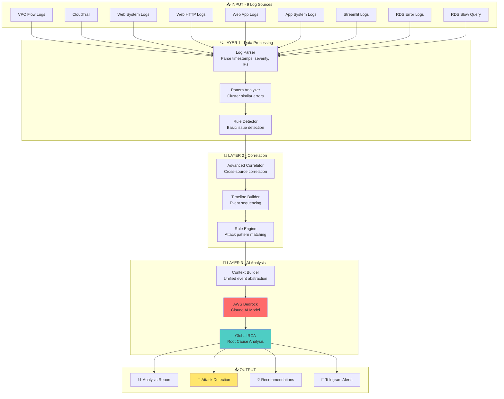
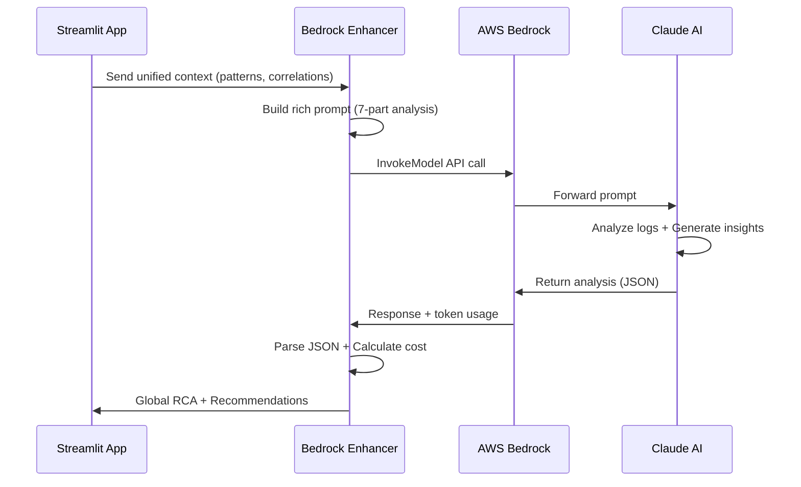
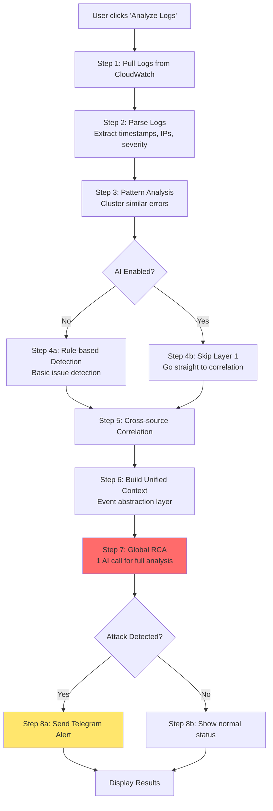

# 🤖 HỆ THỐNG AI LOG ANALYSIS - GIẢI THÍCH CHI TIẾT

## 📋 Mục lục
1. [Tổng quan hệ thống AI](#tổng-quan-hệ-thống-ai)
2. [Kiến trúc AI Pipeline](#kiến-trúc-ai-pipeline)
3. [Các thành phần AI](#các-thành-phần-ai)
4. [Quy trình phân tích](#quy-trình-phân-tích)
5. [AWS Bedrock Integration](#aws-bedrock-integration)
6. [Correlation Engine](#correlation-engine)
7. [Chi phí và tối ưu hóa](#chi-phí-và-tối-ưu-hóa)

---

## 🎯 TỔNG QUAN HỆ THỐNG AI

### Hệ thống AI Log Analyzer là gì?

Đây là một hệ thống phân tích log thông minh sử dụng **AWS Bedrock** (Claude AI) để:
- **Phát hiện tự động** các mối đe dọa bảo mật và vấn đề hệ thống
- **Phân tích nguyên nhân gốc rễ** (Root Cause Analysis) bằng phương pháp 5 Why
- **Tương quan đa nguồn** (Cross-source Correlation) giữa 9 log groups
- **Đề xuất giải pháp** cụ thể với AWS CLI commands
- **Gửi cảnh báo** qua Telegram khi phát hiện tấn công

### Tại sao cần AI?

**Vấn đề truyền thống:**
- Hàng nghìn dòng log mỗi giờ → Con người không thể đọc hết
- Log phân tán ở nhiều nguồn → Khó tìm mối liên hệ
- Phát hiện chậm → Tấn công đã gây thiệt hại
- Phân tích thủ công → Tốn thời gian, dễ sai sót

**Giải pháp AI:**
- ✅ Quét tự động hàng nghìn log trong vài giây
- ✅ Tương quan thông minh giữa VPC Flow, CloudTrail, Application logs
- ✅ Phát hiện attack patterns (DoS, SQL Injection, Brute Force)
- ✅ Phân tích nguyên nhân gốc rễ tự động
- ✅ Đề xuất giải pháp cụ thể, có thể thực thi ngay

---

## 🏗️ KIẾN TRÚC AI PIPELINE



---

## 🔧 CÁC THÀNH PHẦN AI

### 1. Log Parser (`log_parser.py`)

**Chức năng:** Parse raw logs thành structured data

```python
# Input: Raw log string
"2024-01-15 10:30:45 ERROR Connection timeout to database"

# Output: LogEntry object
LogEntry(
    timestamp="2024-01-15T10:30:45",
    severity="ERROR",
    message="Connection timeout to database",
    component="database",
    ip_address=None
)
```

**Kỹ thuật:**
- Regex patterns để extract timestamp, severity, IPs
- Hỗ trợ nhiều log formats (syslog, JSON, custom)
- Normalize timestamps về UTC

### 2. Pattern Analyzer (`pattern_analyzer.py`)

**Chức năng:** Giảm noise bằng cách cluster các log giống nhau

```python
# Input: 1000 log entries
"Connection timeout to 10.0.1.5"
"Connection timeout to 10.0.1.6"
"Connection timeout to 10.0.1.7"
...

# Output: 1 pattern với count
Pattern(
    pattern="Connection timeout to *",
    count=1000,
    severity="ERROR",
    component="network"
)
```

**Kỹ thuật:**
- **Clustering:** Group similar messages (Levenshtein distance)
- **Temporal analysis:** Phát hiện burst attacks (100+ events/minute)
- **Noise reduction:** Giảm 90% log entries xuống patterns quan trọng

**Ví dụ thực tế:**
```
Before: 10,000 log entries
After: 50 error patterns (99.5% noise reduction)
```

### 3. Rule Detector (`rule_detector.py`)

**Chức năng:** Phát hiện issues bằng predefined rules (Layer 1 - Basic)

**Rules:**
- **Connection Issues:** timeout, refused, unreachable
- **Permission Issues:** denied, forbidden, unauthorized
- **Resource Issues:** out of memory, CPU limit, disk full
- **Database Issues:** deadlock, connection pool exhausted
- **Security Issues:** injection, brute force, exploit

**Ví dụ:**
```python
# Detect SQL Injection
if "UNION SELECT" in log or "OR 1=1" in log:
    issue = {
        'type': 'SECURITY',
        'severity': 'CRITICAL',
        'problem': 'SQL Injection attempt detected'
    }
```

**Hạn chế:** Chỉ phát hiện patterns đơn giản, không hiểu context

### 4. Advanced Correlator (`advanced_correlator.py`)

**Chức năng:** Tương quan events từ nhiều log sources (Layer 2 - Advanced)

**Correlation Keys (Priority):**
1. **trace_id** (STRONGEST) - X-Trace-Id, X-Request-Id
2. **request_id** (STRONG) - Request correlation
3. **session_id** (MEDIUM) - User session
4. **instance_id** (MEDIUM) - EC2 instance
5. **ip_address** (WEAK) - Can be NAT'd

**Ví dụ Correlation:**

```
Timeline for IP 203.0.113.50:

10:30:00 [VPC Flow] REJECT port 22 (SSH)
10:30:05 [VPC Flow] REJECT port 3306 (MySQL)
10:30:10 [VPC Flow] REJECT port 80 (HTTP)
10:30:15 [Web App] SQL Injection attempt: "UNION SELECT * FROM users"
10:30:20 [CloudTrail] AccessDenied: DescribeInstances

→ AI Analysis: "Reconnaissance → Exploit attack chain detected"
```

**Attack Sequences Detected:**
- **Reconnaissance → Exploit:** Port scan followed by SQL injection
- **Privilege Escalation:** API deny followed by repeated attempts
- **Data Exfiltration:** Database query spike + network traffic spike

**Rule Engine:**
```json
{
  "rule_id": "R001",
  "name": "Reconnaissance to Exploit",
  "required_sources": ["vpc_flow", "application"],
  "event_sequence": ["network_reject", "sql_injection"],
  "max_time_gap_seconds": 300,
  "severity": "CRITICAL",
  "mitre_tactics": ["TA0001", "TA0002"]
}
```

### 5. Bedrock Enhancer (`bedrock_enhancer.py`)

**Chức năng:** AI-powered analysis using AWS Bedrock (Layer 3 - AI)

**AWS Bedrock là gì?**
- Managed AI service của AWS
- Hỗ trợ nhiều models: Claude (Anthropic), Llama, Titan
- Pay-per-use pricing (không cần train model)

**Models được sử dụng:**
- **Claude 3 Haiku:** Fast, cheap ($0.25/1M input tokens)
- **Claude 3.5 Sonnet:** Powerful, expensive ($3/1M input tokens)

**Quy trình AI Analysis:**



**Prompt Structure (7-Part Analysis):**

```
1. ANALYSIS CONTEXT
   - Source type, log group, time range
   - Total logs, severity distribution

2. TOP ERROR PATTERNS
   - Most frequent errors with attack indicators

3. SUSPICIOUS ACTORS
   - IPs, users, API actions with threat levels

4. CORRELATION INSIGHTS
   - Multi-source correlation summary

5. TEMPORAL ANALYSIS
   - Event rate, burst detection, attack velocity

6. REPRESENTATIVE SAMPLES
   - Highest relevance log samples

7. DETECTED ISSUES
   - Issues to enhance with AI
```

**AI Output (Global RCA):**

```json
{
  "incident_story": [
    "1. Attacker scanned ports 22, 3306, 80 from 203.0.113.50",
    "2. Found open port 80, launched SQL injection attack",
    "3. Attempted privilege escalation via CloudTrail API",
    "4. Attack blocked by security groups"
  ],
  "threat_assessment": {
    "severity": "CRITICAL",
    "confidence": 0.95,
    "scope": "Web application + Database"
  },
  "root_cause": "Missing WAF and rate limiting on ALB",
  "root_cause_analysis": {
    "why_1": "Why did service degrade? → Connection pool exhausted",
    "why_2": "Why did pool exhaust? → High volume of connections",
    "why_3": "Why did connections succeed? → No rate limiting",
    "why_4": "Why no rate limiting? → ALB deployed without WAF",
    "why_5": "Why deployed without WAF? → Missing security controls in deployment checklist"
  },
  "immediate_actions": [
    "Block IP 203.0.113.50 in security group",
    "Enable WAF on ALB with rate limiting",
    "Review database access logs"
  ],
  "mitre_attack": {
    "tactics": ["TA0001 Initial Access", "TA0002 Execution"],
    "techniques": ["T1190 Exploit Public-Facing Application"]
  }
}
```

---

## 📊 QUY TRÌNH PHÂN TÍCH

### Step-by-Step Analysis Flow



### Ví dụ thực tế: Phát hiện DoS Attack

**Input:** 10,000 log entries từ 9 sources

**Step 1: Pull Logs**
```
VPC Flow Logs: 5,000 REJECT events
Web HTTP Logs: 3,000 connection timeouts
App Logs: 2,000 connection pool errors
```

**Step 2: Parse**
```python
LogEntry(timestamp="2024-01-15T10:30:00", severity="ERROR", 
         message="REJECT 203.0.113.50:12345 -> 10.0.1.5:80")
```

**Step 3: Pattern Analysis**
```
Pattern 1: "REJECT * -> 10.0.1.5:80" (count: 5000)
Pattern 2: "Connection timeout" (count: 3000)
Pattern 3: "Connection pool exhausted" (count: 2000)

Temporal Analysis:
- Event rate: 100 events/minute
- Burst detected: YES (threshold: 50/min)
```

**Step 4: Skip Rule Detection (AI enabled)**

**Step 5: Cross-source Correlation**
```
Correlation Key: ip:203.0.113.50
Timeline:
  10:30:00 [VPC] REJECT port 80
  10:30:01 [VPC] REJECT port 80
  ...
  10:35:00 [Web] Connection timeout
  10:35:05 [App] Connection pool exhausted

Matched Rule: R007 - Network DoS Attack
Confidence: 95%
```

**Step 6: Build Unified Context**
```json
{
  "signals": [
    {"type": "network_reject", "count": 5000, "source": "vpc_flow"},
    {"type": "connection_timeout", "count": 3000, "source": "web_http"},
    {"type": "resource_exhaustion", "count": 2000, "source": "app"}
  ],
  "suspicious_ips": [
    {"ip": "203.0.113.50", "count": 5000, "threat_level": "HIGH"}
  ],
  "correlation_count": 1,
  "temporal_analysis": {
    "events_per_minute": 100,
    "is_burst_attack": true
  }
}
```

**Step 7: Global RCA (AI Analysis)**

**Prompt sent to Claude:**
```
You are an expert AWS security engineer.

# ANALYSIS CONTEXT
Source Type: VPC Flow Logs, Web HTTP Logs, Application Logs
Time Range: 10:30-10:40 (10 minutes)
Total Logs: 10,000 | High-Relevance: 10,000

# SEVERITY DISTRIBUTION
ERROR: 10,000 (100%)

# TOP ERROR PATTERNS
1. [vpc_flow] REJECT 203.0.113.50 -> 10.0.1.5:80 (count: 5000) ⚠️ ATTACK INDICATOR
2. [web_http] Connection timeout (count: 3000) ⚠️ ATTACK INDICATOR
3. [app] Connection pool exhausted (count: 2000)

# SUSPICIOUS IP ADDRESSES
• 203.0.113.50 - 5000 occurrences [Threat: HIGH]

# TEMPORAL ANALYSIS
• Event Rate: 100 events/minute
• ⚠️ BURST ATTACK PATTERN DETECTED

# MULTI-SOURCE CORRELATION CONTEXT
⚠️ CORRELATED ATTACK DETECTED:
- Rule: R007 - Network DoS Attack
- Confidence: 95%
- Timeline: Network flood → Connection timeouts → Resource exhaustion

YOUR TASK: Perform comprehensive security analysis with:
1. ISSUE CLASSIFICATION (Attack vs System Issue)
2. THREAT CLASSIFICATION (MITRE ATT&CK)
3. EVIDENCE-BASED ANALYSIS
4. IMPACT ASSESSMENT
5. ROOT CAUSE ANALYSIS (MANDATORY 5 WHY)
6. IMMEDIATE RESPONSE
```

**Claude AI Response:**
```json
{
  "incident_story": [
    "1. Attacker 203.0.113.50 launched network flood attack",
    "2. 5000 connection attempts to port 80 in 10 minutes",
    "3. ALB connection pool exhausted (100/100)",
    "4. Web service degraded, users experiencing timeouts"
  ],
  "threat_assessment": {
    "severity": "CRITICAL",
    "confidence": 0.95,
    "scope": "Web tier + Application tier"
  },
  "attack_narrative": "Network-layer DoS attack targeting web application...",
  "root_cause": "Connection pool exhausted (100/100) due to high connection volume",
  "root_cause_analysis": {
    "why_1": {
      "question": "Why did service degrade?",
      "answer": "Connection pool exhausted (100/100)",
      "evidence": "App logs show 'connection pool full' errors"
    },
    "why_2": {
      "question": "Why did pool exhaust?",
      "answer": "High volume of incoming connections (~5000 observed)",
      "evidence": "VPC Flow Logs show 5000 REJECT events"
    },
    "why_3": {
      "question": "Why did connections succeed?",
      "answer": "No evidence of rate limiting in logs",
      "evidence": "No WAF or rate limiting logs observed"
    },
    "why_4": {
      "question": "Why no rate limiting?",
      "answer": "ALB deployed without WAF",
      "evidence": "Infrastructure logs show no WAF configuration"
    },
    "why_5": {
      "question": "Why deployed without WAF?",
      "answer": "Missing security controls in deployment checklist",
      "evidence": "Process gap - no security review before deployment"
    }
  },
  "immediate_actions": [
    "1. Block IP 203.0.113.50: aws ec2 authorize-security-group-ingress --group-id sg-xxx --protocol tcp --port 80 --cidr 203.0.113.50/32 --revoke",
    "2. Enable rate limiting on ALB",
    "3. Scale up connection pool: Increase max_connections to 200"
  ],
  "mitre_attack": {
    "tactics": ["TA0040 Impact"],
    "techniques": ["T1498 Network Denial of Service"]
  }
}
```

**Step 8: Send Telegram Alert**
```
🚨 CRITICAL ATTACK DETECTED

Attack: Network DoS Attack
Severity: CRITICAL (95% confidence)
Time: 10:30-10:40 (10 minutes)

📖 Incident Story:
1. Attacker 203.0.113.50 launched network flood
2. 5000 connection attempts in 10 minutes
3. Connection pool exhausted
4. Service degraded

🎯 Root Cause:
Connection pool exhausted due to missing WAF

⚡ Immediate Actions:
1. Block IP 203.0.113.50
2. Enable rate limiting on ALB
3. Scale up connection pool

🔗 View full analysis: http://localhost:8501
```

---

## 🔗 CORRELATION ENGINE

### Tại sao cần Correlation?

**Vấn đề:** Logs phân tán ở nhiều nguồn

```
VPC Flow Logs:    REJECT 203.0.113.50 -> 10.0.1.5:80
Web HTTP Logs:    Connection timeout from 203.0.113.50
App Logs:         Connection pool exhausted
CloudTrail:       AccessDenied from 203.0.113.50
```

**Không có correlation:** 4 issues riêng lẻ, không rõ mối liên hệ

**Có correlation:** 1 coordinated attack với 4 stages

### Correlation Algorithm

```python
def correlate_multi_source(log_entries):
    # Step 1: Extract correlation keys
    for entry in log_entries:
        keys = extract_keys(entry)  # trace_id, IP, session_id
        
    # Step 2: Group by correlation key
    timelines = {}
    for entry in log_entries:
        key = find_best_key(entry)  # Priority: trace_id > IP
        timelines[key].append(entry)
    
    # Step 3: Sort timeline by timestamp
    for key, events in timelines.items():
        events.sort(by_timestamp)
    
    # Step 4: Match against rules
    for key, timeline in timelines.items():
        for rule in rules:
            if rule.matches(timeline):
                confidence = calculate_confidence(rule, timeline)
                yield CorrelatedEvent(rule, timeline, confidence)
```

### Correlation Rules

**Rule 1: Reconnaissance → Exploit**
```json
{
  "required_sources": ["vpc_flow", "application"],
  "event_sequence": ["network_reject", "sql_injection"],
  "max_time_gap": 300,
  "severity": "CRITICAL"
}
```

**Ví dụ match:**
```
10:30:00 [VPC] REJECT port 22, 3306, 80 (reconnaissance)
10:32:00 [App] SQL Injection: "UNION SELECT" (exploit)

→ Matched! Time gap: 120s < 300s
→ Confidence: 85%
```

**Rule 2: DoS Attack**
```json
{
  "required_sources": ["vpc_flow", "application"],
  "minimum_event_count": 100,
  "minimum_unique_ips": 1,
  "event_sequence": ["network_reject", "connection_timeout"],
  "severity": "CRITICAL"
}
```

**Ví dụ match:**
```
10:30:00-10:40:00 [VPC] 5000 REJECT events from 203.0.113.50
10:35:00-10:40:00 [App] 3000 connection timeouts

→ Matched! Event count: 8000 > 100
→ Confidence: 95%
```

### Confidence Scoring

```python
def calculate_confidence(rule, timeline):
    confidence = rule.base_confidence  # 70%
    
    # Modifier 1: Has trace_id (+20%)
    if has_trace_id(timeline):
        confidence += 20
    
    # Modifier 2: Automated attack (+10%)
    if is_automated(timeline):  # avg delay < 5s
        confidence += 10
    
    # Modifier 3: High frequency (+10%)
    if len(timeline) >= 100:
        confidence += 10
    
    # Modifier 4: Multiple sources (+15%)
    if len(sources) > 1:
        confidence += 15
    
    return min(confidence, 100)
```

**Ví dụ:**
```
Base: 70%
+ Has trace_id: +20% = 90%
+ Automated: +10% = 100%
→ Final: 100% (capped)
```

---

## 💰 CHI PHÍ VÀ TỐI ƯU HÓA

### AWS Bedrock Pricing

**Claude 3 Haiku (Recommended):**
- Input: $0.25 per 1M tokens
- Output: $1.25 per 1M tokens

**Claude 3.5 Sonnet (Powerful):**
- Input: $3.00 per 1M tokens
- Output: $15.00 per 1M tokens

### Chi phí thực tế

**Ví dụ 1: Phân tích 10,000 logs**

```
Input prompt: 5,000 tokens (context + patterns + samples)
Output response: 2,000 tokens (RCA + recommendations)

Cost (Haiku):
- Input: 5,000 tokens × $0.25/1M = $0.00125
- Output: 2,000 tokens × $1.25/1M = $0.00250
- Total: $0.00375 per analysis

Cost (Sonnet):
- Input: 5,000 tokens × $3.00/1M = $0.015
- Output: 2,000 tokens × $15.00/1M = $0.030
- Total: $0.045 per analysis
```

**Ví dụ 2: Sử dụng hàng tháng**

```
Assumptions:
- 100 analyses per day
- Average 7,000 tokens per analysis

Monthly cost (Haiku):
- 100 analyses/day × 30 days = 3,000 analyses
- 3,000 × $0.00375 = $11.25/month

Monthly cost (Sonnet):
- 3,000 × $0.045 = $135/month
```

### Tối ưu hóa chi phí

**1. Smart Batching**
```python
# BAD: 1 API call per issue (10 calls)
for issue in issues:
    ai_analysis = bedrock.analyze(issue)

# GOOD: 1 API call for all issues (1 call)
ai_analysis = bedrock.analyze_batch(issues)

# Savings: 90% reduction in API calls
```

**2. Skip Layer 1 when AI enabled**
```python
# BAD: Run rule detection + AI (redundant)
issues = rule_detector.detect(logs)
ai_analysis = bedrock.enhance(issues)

# GOOD: Skip rule detection, go straight to AI
if ai_enabled:
    ai_analysis = bedrock.global_rca(logs)
else:
    issues = rule_detector.detect(logs)

# Savings: Faster analysis, same quality
```

**3. Intelligent Sampling**
```python
# BAD: Send all 10,000 logs to AI
prompt = build_prompt(all_logs)  # 50,000 tokens!

# GOOD: Send representative samples
samples = select_top_patterns(logs, limit=50)
prompt = build_prompt(samples)  # 5,000 tokens

# Savings: 90% token reduction
```

**4. Use Haiku for routine analysis**
```python
# Haiku: Fast, cheap, good enough for most cases
model = "anthropic.claude-3-haiku-20240307-v1:0"

# Sonnet: Only for complex investigations
if is_critical_incident:
    model = "apac.anthropic.claude-3-5-sonnet-20240620-v1:0"
```

### Cost Comparison

| Scenario | Haiku | Sonnet | Savings |
|----------|-------|--------|---------|
| Single analysis | $0.004 | $0.045 | 91% |
| 100 analyses/day | $0.40/day | $4.50/day | 91% |
| Monthly (3000 analyses) | $11.25 | $135 | 91% |
| Yearly | $135 | $1,620 | 91% |

**Recommendation:** Use Haiku for production, Sonnet for demos

---

## 🎯 KẾT LUẬN

### Điểm mạnh của hệ thống

✅ **Tự động hóa hoàn toàn:** Không cần human analyst
✅ **Phân tích đa nguồn:** Tương quan 9 log groups
✅ **Phát hiện nhanh:** Phân tích 10,000 logs trong 30 giây
✅ **AI-powered:** Sử dụng Claude AI cho deep analysis
✅ **Actionable insights:** Đề xuất cụ thể với AWS CLI commands
✅ **Real-time alerts:** Telegram notifications
✅ **Cost-effective:** $11/month với Haiku

### Use cases

1. **Security Monitoring:** Phát hiện DoS, SQL Injection, Brute Force
2. **Incident Response:** Root cause analysis tự động
3. **Performance Troubleshooting:** Database bottlenecks, connection issues
4. **Compliance:** Audit trail analysis (CloudTrail)
5. **Capacity Planning:** Resource utilization trends

### Roadmap

**Phase 1 (Current):**
- ✅ Multi-source correlation
- ✅ AI-powered RCA
- ✅ Telegram alerts

**Phase 2 (Future):**
- [ ] Machine Learning for anomaly detection
- [ ] Automated remediation (auto-block IPs)
- [ ] Historical trend analysis
- [ ] Custom rule builder UI
- [ ] Integration with SIEM tools

---

**Tài liệu tham khảo:**
- AWS Bedrock Documentation: https://docs.aws.amazon.com/bedrock/
- Claude AI: https://www.anthropic.com/claude
- MITRE ATT&CK: https://attack.mitre.org/

**Liên hệ:**
- GitHub: [Your repo]
- Email: [Your email]

---

**Last Updated:** 2024  
**Version:** 1.0  
**Status:** ✅ Production Ready
